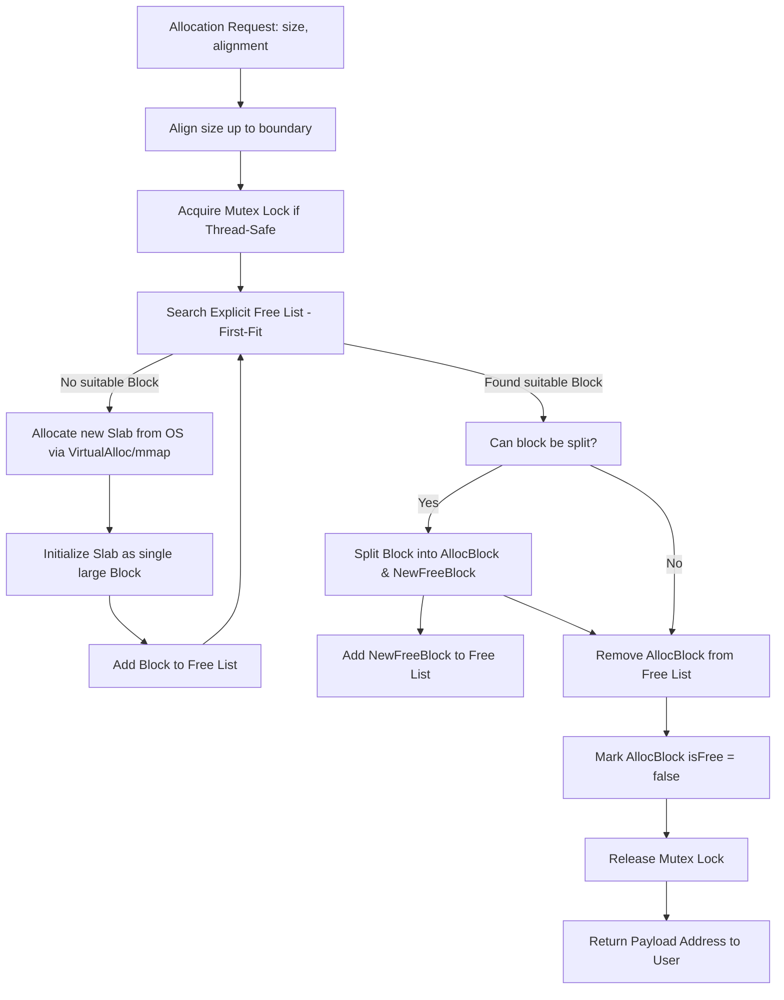
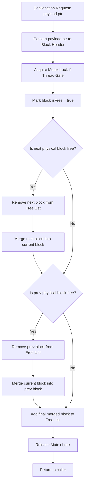

# Architecture Diagrams & Design Specifications

This document details the architectural layout of the Custom Memory Pool Allocator, illustrating how slabs, blocks, and free lists interact to provide high-performance allocation.

---

## 1. Physical Layout of an OS Slab

When the `MemoryPool` requires memory, it requests a large contiguous chunk (Slab) from the OS (e.g., 4MB). Inside this slab, memory is divided into contiguous `Block`s.

```text
+---------------------------------------------------------------------------------------------------+
|                                      OS-Allocated Slab (e.g., 4MB)                                |
+---------------------------------------------------------------------------------------------------+
|      Block 1 (Allocated)       |       Block 2 (Free)            |      Block 3 (Allocated)       |
+--------------------------------+---------------------------------+--------------------------------+
| [Block Header]                 | [Block Header]                  | [Block Header]                 |
| - size: 128 bytes              | - size: 512 bytes               | - size: 256 bytes              |
| - isFree: false                | - isFree: true                  | - isFree: false                |
| - next: Block 2                | - next: Block 3                 | - next: nullptr                |
| - prev: nullptr                | - prev: Block 1                 | - prev: Block 2                |
+--------------------------------+---------------------------------+--------------------------------+
| [User Payload]                 | [User Payload / Empty]          | [User Payload]                 |
| (128 bytes of user data)       | (512 bytes of free space)       | (256 bytes of user data)       |
+--------------------------------+---------------------------------+--------------------------------+
```

---

## 2. Explicit Free List vs. Physical Memory Layout

To keep allocation fast ($O(\text{Free Blocks})$), we maintain an **Explicit Free List** connecting only the free blocks. This is represented by `nextFree` and `prevFree` pointers in the block header.

```text
Physical Chain (Contiguous in Memory):
[ Block 1 (Allocated) ] <---> [ Block 2 (Free) ] <---> [ Block 3 (Allocated) ] <---> [ Block 4 (Free) ]
                                     ^                                                   ^
                                     |                                                   |
Explicit Free List Chain:            +------------------ nextFree -----------------------+
(Only traverses free blocks)         +------------------ prevFree -----------------------+
```

---

## 3. Allocation Workflow Flowchart



---

## 4. Deallocation & Coalescing Workflow Flowchart



---

## 5. Memory Alignment Mechanics

To guarantee that returned pointers are properly aligned (e.g., on 16-byte boundaries for SSE/AVX vectors), we perform bitwise alignment calculations:

$$\text{Aligned Size} = (\text{Requested Size} + \text{Alignment} - 1) \ \& \ \sim(\text{Alignment} - 1)$$

For example, aligning size `100` to `16`-byte boundary:
* $\text{Requested Size} = 100$
* $\text{Alignment} = 16$
* $\text{Aligned Size} = (100 + 15) \ \& \ \sim15 = 115 \ \& \ 0xFFFFFFF0 = 112$ bytes.
